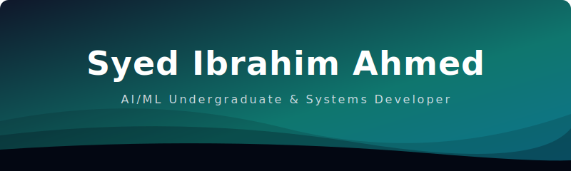

<div align="center">

<!-- Glowing Animated Header Banner -->


<br />

<!-- Animated Role Typewriter Subheading -->


<br /><br />

<!-- Profile Academic Details -->


<br /><br />

<!-- Social Connect Cards -->
[](https://www.linkedin.com/in/syed-ibrahim-ahmed-84312a224/)
[](mailto:syedibrahimahmed.dev@gmail.com)
[](https://github.com/alphadevib)

<br /><br />

<!-- Profile Analytics Counters -->


</div>

---

<table width="100%">
  <tr>
    <td width="25%"><b>🟢 STATUS</b></td>
    <td>Learning by building intelligent systems</td>
  </tr>
  <tr>
    <td width="25%"><b>🧭 CURRENT VECTOR</b></td>
    <td>AI/ML · Computer Vision · Practical Products</td>
  </tr>
  <tr>
    <td width="25%"><b>🎯 LONG-TERM MISSION</b></td>
    <td>Use AI to create accessible, high-impact solutions</td>
  </tr>
</table>

## 🧠 About me

```yaml
name: "Syed Ibrahim Ahmed"
role: "AI/ML Undergraduate"
education: "B.Tech in Artificial Intelligence & Machine Learning — Anurag University"
graduation: "2028"
location: "Hyderabad, India"
focus: "Computer vision · intelligent systems · real-world AI"
```

I’m an AI/ML student who enjoys converting ideas into practical software. I’m especially interested in computer vision, machine learning, and building intelligent products that can make a real difference—particularly in healthcare and campus technology.

## ⚡ Featured build

### CampFind — Smart Campus Lost & Found System

An AI-powered web app that helps people report and recover lost items on campus.

- **Detection:** TensorFlow Lite detects common campus items.
- **Matching:** MobileNetV2 features and cosine similarity identify likely matches.
- **Stack:** Flask REST API, SQLite, HTML, CSS, and JavaScript.
- **Goal:** Make lost-item recovery faster, simpler, and smarter.

---

## 🛠️ Stack

<p>
  
</p>

---

## 📈 Live GitHub activity

<div align="center">
  
  
</div>

<br />

<div align="center">
  
</div>

---

## 📡 Experience & learning

- 🧑‍💻 **Google AI-ML Intern** — Remote internship, Apr–Jun 2026.
- 🎓 Completed an **8-week AI/ML virtual internship** supported by AICTE, EduSkills, the National Internship Portal, and Google for Developers.
- 🏆 Active in hackathons and innovation events, including **TECHNIDHI 2026 — Hack the Matrix** and **AVINYA 2025**.

<br />

<div align="center">
  <sub>BUILD • LEARN • ITERATE</sub>
</div>
